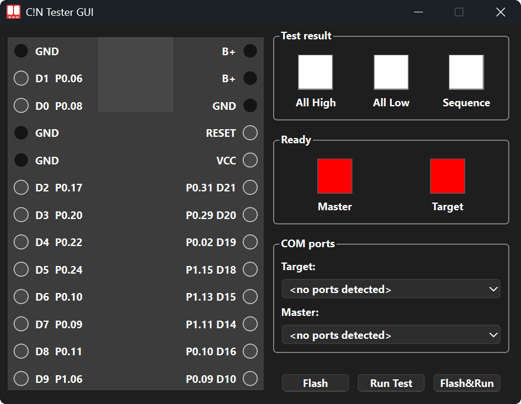

# c!n tester: ProMicro-like Microcontroller Tester

## 🚀 Project Overview

The **c!n tester** is a dedicated hardware and software solution designed for automated functional testing of ProMicro-like microcontrollers (MCUs). Its primary goal is to provide a fast and reliable way to verify basic pin connectivity and functionality before deployment.

### 🚧 Current Status: Work In Progress (WIP)

The core testing logic and fundamental functionality are fully operational. However, active development is focused on improving the GUI and enhancing the overall user experience.

## 🧱 Hardware System

The hardware consists of a custom Printed Circuit Board (PCB) housing two microcontrollers:

1. **Master MCU:** Controls the entire testing process, communicates with the host application, and manages test sequences.

2. **Target MCU:** This is the ProMicro-like microcontroller under test.
   
Essentially, the PCB represents a direct connection of the pins of the two microcontrollers; the same setup can be achieved using regular wires.


## 💻 Software System




**Technology Stack:** 
* Python 3.10+ 
* PySide6 — used to create the graphical user interface (GUI).
* Nuitka — used to compile Python code into standalone executable files.
* platformio — used to compile MCU firmware.
* adafruit-nrfutil — used for flashing firmware onto microcontrollers.
* pyserial — provides communication between the computer and microcontrollers via COM ports.

All communication between the host application (software) and the MCUs is conducted via serial ports (COM ports).

Currently, there is no fully developed CLI application, but since both the Target and Master microcontrollers are connected to the computer via COM ports, you can interact with them directly using standard terminal commands.

## ⚙️ Testing Process Details

The system is designed for quick, repeatable functional checks. The Master MCU and the Target MCU communicate over dedicated lines to perform the tests.

### Test Sequence

The program waits for both the Master and Target MCUs to signal readiness. Once ready, the following sequence of basic electrical tests is performed:

1. **All Pins HIGH:** Verifies the ability of all pins on the Target MCU to be driven to a logic HIGH state.

2. **All Pins LOW:** Verifies the ability of all pins on the Target MCU to be driven to a logic LOW state.

3. **Individual Pin Check:** Each I/O pin is individually tested for its ability to transition between HIGH and LOW and to be correctly read by the Master MCU.

### Test Indicators (Current State)

The dedicated LED indicator on the PCB is included in the hardware design but is **not yet functional**. For now, focus on the indicators in the application and the standard LEDs of the microcontrollers.

### Workflow for Testing a New Target

1. Connect the **Master MCU** to the host computer.
2. Open the **c!n tester** application.
3. Connect the new **Target MCU** (the device to be tested).
4. Click the **"Flash & Run"** button.
5. Wait for the test completion and observe the indicator status.
6. Insert a new Target MCU for the next test cycle.

For now, the Master MCU is flashed manually using a uf2 file. Put the MCU into bootloader mode and copy the file to it.

## 📝 Usage Guide

The recommended and simplest way to use the application is by using the **pre-compiled binaries** available in the project's [Releases](https://github.com/aroum/cn_tester/releases/) section.

### 📦 Running Standalone Binaries (Recommended)

1. Download the executable file for your operating system from the project's [Releases](https://github.com/aroum/cn_tester/releases/) page.

2. **For Linux/macOS:** You must grant execution permissions before launching the binary:

   ```bash
   chmod +x cn_tester_app
   ```
3. **For Linux:** To allow the application to access /dev/ttyACM*, you need to add the current user to the dialout group:
   ```bash
   sudo usermod -a -G dialout $USERÍ
   ```
4. Flashing Feature Dependency: If you plan to use the target MCU flashing function, you must have the adafruit-nrfutil utility available on your system. You can ensure this in two ways:
     * Install via Pip : `pip install adafruit-nrfutil`.
     * Local Binary: Download a pre-compiled binary of [adafruit-nrfutil](https://github.com/adafruit/Adafruit_nRF52_nrfutil/releases) from its project releases and place it alongside the C!N tester app executable.
5. Launch the application:
   * **For Linux:** `./cn_tester_app_linux_x64`
   * **macOS:** `./cn_tester_app_macos_aarch64`
   * **Windows:** `cn_tester_win_x64.exe`

You can view the logs by clicking on the image of the USB port.
  
### 🐍 Running from Source (Development)

This method is recommended only for development or if you wish to modify the source code.

#### Prerequisites:

Python 3.10 or newer.

#### Dowloand source code:
```
git clone https://github.com/aroum/cn_tester.git
```

#### Install Dependencies:
```
pip install -r requirements.txt
```


if you use conda:
```
conda install libpython-static
```

#### Execute the Application:
```
python main.py
```

### 🏗️ Building Standalone Binaries (Nuitka)

To compile the application into a standalone executable that does not require a local Python 3.10+ environment, use the Nuitka compiler. For details, see the [nuitka documentation](https://nuitka.net/user-documentation/user-manual.html).

#### Dowloand source code:

```
git clone https://github.com/aroum/cn_tester.git
```
#### Install dependencies:

```
pip install -r requirements_build.txt
```

#### 🍏 macOS Compilation

##### Prerequisites:
* [Xcode](https://apps.apple.com/us/app/xcode/id497799835?mt=12)
* [Homebrew](https://brew.sh)

##### Create and activate a clean environment

``` bash
brew install python@3.10 nuitka
python3.10 -m venv /tmp/cleanenv
source /tmp/cleanenv/bin/activate
# source /tmp/cleanenv/bin/activate.fish #for fish
pip install -r requirements_build.txt
```

##### Compilation:
``` bash
nuitka  \
   --onefile  \
   --macos-create-app-bundle \
   --macos-app-icon=ICON_PATH \
   --macos-app-name=MACOS_APP_NAME \
   --macos-app-icon=icon/icon.png=icon/icon.png 
   --enable-plugin=pyside6  \
   --include-data-files=icon/icon.png=icon/icon.png \
   --include-data-dir=mcu_firmware=mcu_firmware \
   --include-data-files=mcu_firmware/firmware_target.hex=mcu_firmware/firmware_target.hex \
   --output-dir=build \
   --product-name="C!N Tester GUI" \
   --clean-cache=all \
   --output-filename=cn_tester_app.app \
   main.py
```

#### 🪟 Windows Compilation
##### Prerequisites:
*  Visual Studio C++ build tools

##### Compilation:
``` bash
call "C:\Program Files\Microsoft Visual Studio\2022\BuildTools\VC\Auxiliary\Build\vcvars64.bat"

nuitka ^
  --onefile ^
  --windows-console-mode=disable ^
  --enable-plugin=pyside6 ^
  --windows-icon-from-ico=icon/icon.ico ^
  --include-data-files=icon/icon.png=icon/icon.png ^
  --include-data-dir=mcu_firmware=mcu_firmware ^
  --include-data-files=mcu_firmware/firmware_target.hex=mcu_firmware/firmware_target.hex ^
  --output-dir=build ^
  --product-name="C!N Tester GUI" ^
  --file-version=0.1.0 ^
  --clean-cache=all ^
  --output-filename=cn_tester_app.exe ^
  main.py
```

#### 🐧 Linux Compilation
##### Prerequisites:
* python3-dev package
* GCC
* patchelf


##### Compilation:  
``` bash
nuitka  \
   --onefile  \
   --enable-plugin=pyside6  \
   --include-data-files=icon/icon.png=icon/icon.png \
   --include-data-dir=mcu_firmware=mcu_firmware \
   --include-data-files=mcu_firmware/firmware_target.hex=mcu_firmware/firmware_target.hex \
   --output-dir=build \
   --product-name="C!N Tester GUI" \
   --clean-cache=all \
   --output-filename=cn_tester_app.bin \
   main.py
```


### 💡 Future Plans

We have several improvements planned for the upcoming sprints:

* Bluetooth Functionality Testing: Planning and implementation of test sequences to verify the basic operation of the Target MCU's Bluetooth features.
* Setup CI/CD with GitHub Actions: Implement GitHub Actions workflows for automated cross-platform compilation of the application binaries and firmware flashing.
* Add some renders of the PCB and case, as well as screenshots of the app.
* Work on the documentation.

### 🙏 Acknowledgements

A special thank you to the following community members:

Compilation & Testing: [@Rowb](https://github.com/Rowb), [@turtle-bazon](https://github.com/turtle-bazon)
