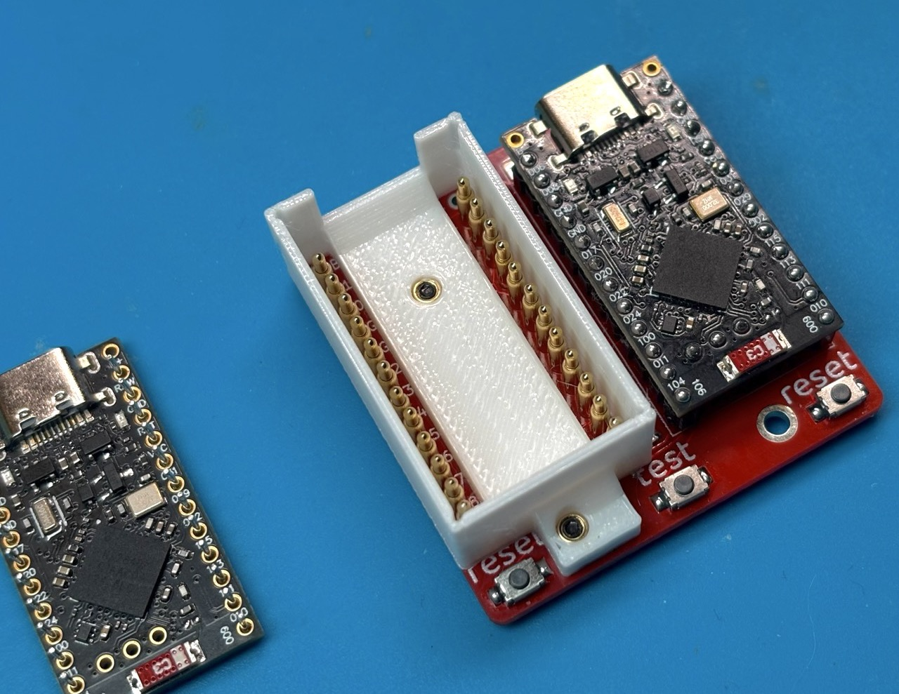
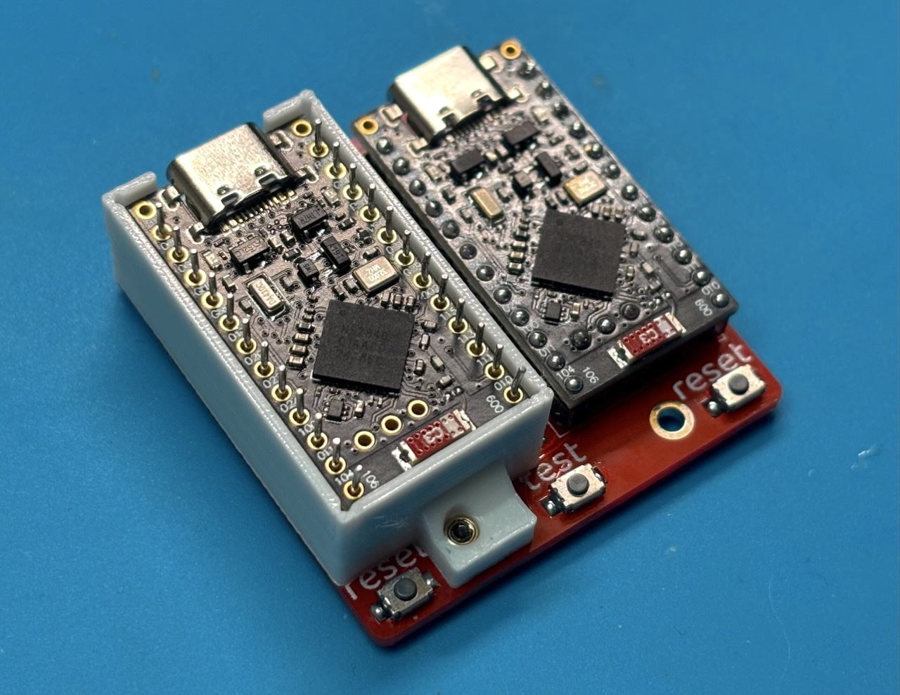

# Holder

A small 3D-printed holder that keeps the target board in place during testing so it doesn't slip off the contacts. Especially useful when the target board already has its pin headers soldered on.

| | |
|---|---|
|  |  |

## BOM

* screws size: m2x5 (2 pcs)
* brass inserts size: m2x3x3.2 (2 pcs)

## Files

- [holder.step](holder.step) — editable CAD source
