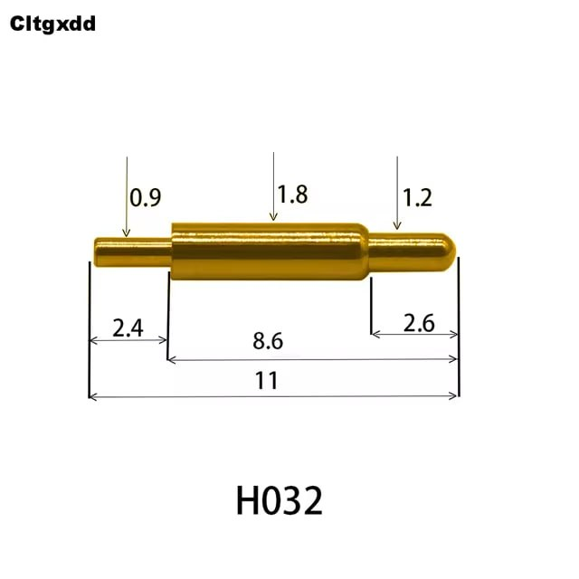

# Panel

In the panel folder, a 2x2 panel option is available, its size is smaller than 100x100 mm.

# Gerber files

Gerber files can be downloaded in [releases](https://github.com/aroum/cn_tester/releases).

# BOM

| Item                                                      |  Qty | Remarks                  |
| --------------------------------------------------------- | ---: | ------------------------ |
| MCU                                                       |    2 | target and master        |
| [Sockets](https://github.com/joric/nrfmicro/wiki/Sockets) | 12x4 | for MCU                  |
| SMD button 3x4x2mm                                        |    3 | for reset and start test |
| SMD resistor 0603 1-5k                                    |    1 |                          |
| SMD LED 0603                                              |    1 |                          |

[IBOM](https://htmlpreview.github.io/?https://github.com/aroum/PNCATEHO/blob/master/pcb/cn_tester/ibom/ibom.html)

You can use any sockets for the target microcontroller, but if you want to test the microcontroller without soldering I recommend spring pin headers or pogo pins (H032). When using H032 you will need to press them to ensure good contact.

Thanks to [@ShyPsy](https://github.com/ShyPsy) for choosing and testing suitable pogo pins.
